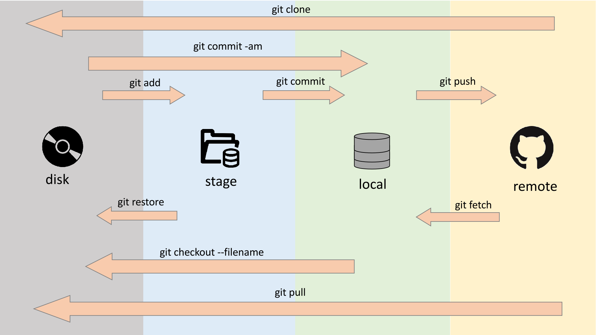
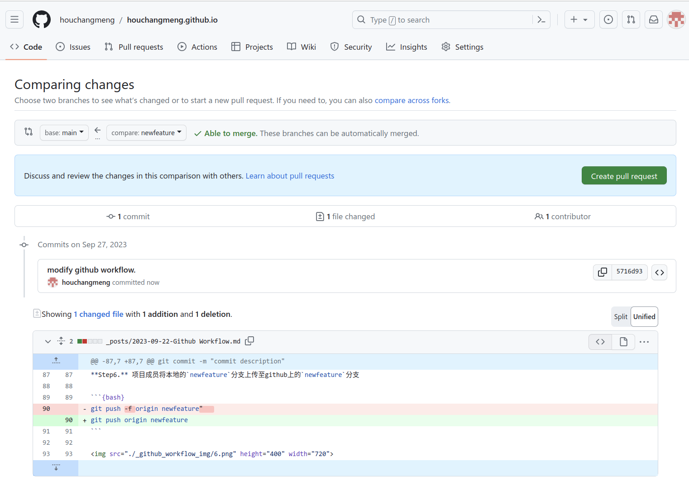

# Git/Github



---

## 参考

https://www.bilibili.com/video/BV19e4y1q7JJ

https://www.bilibili.com/video/BV1r3411F7kn

---

## 基本流程

**Step1.** 拉取或者克隆代码到本地

```{bash}
git pull origin main
git clone
```


---

**Step2.** 切换到`newfeature`的分支

```{bash}
git checkout -b <name>
```

或

```{bash}
git branch <name>
git switch <name>
```


---

**Step3.** 修改或者添加本地代码，查看对代码做出的改变

```{bash}
git diff
```


---

**Step4.** 上传更新后的代码至**暂存区**  

```{bash}
git add .
```


---

**Step5.** 将暂存区里更新后的代码更新到**本地git**

```{bash}
git commit -m "commit description"   
```


---

**Step6.** 项目成员将本地的`newfeature`分支上传至github上的`newfeature`分支  

```{bash}
git push origin newfeature
```


---

**Step7.** 项目成员在github网页中的*Pull request*点击*New pull request*,向项目主人发起一个合并请求。




---

**Step8.** 项目主人采用Squash and merge合并Pull request中所有不同的commit  


---

**Step9.** 项目主人删除`newfeature`分支


---
---

## 远端完成更新后

**Step1.** 项目成员在本地切换到 `main` branch上

**Step2.** 删除本地的git分支

```{bash}
git branch -D newfeature 
```


**Step3.** 再把远端的最新代码拉至本地  

```{bash}
git pull origin main 
```


