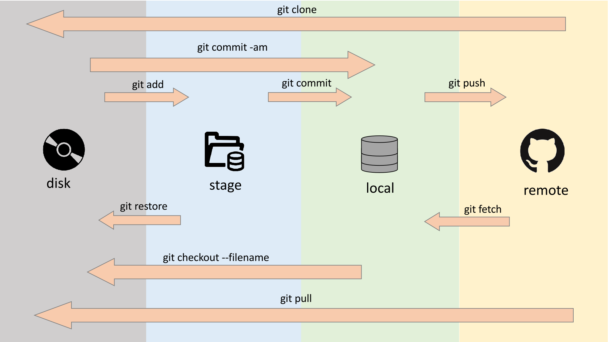
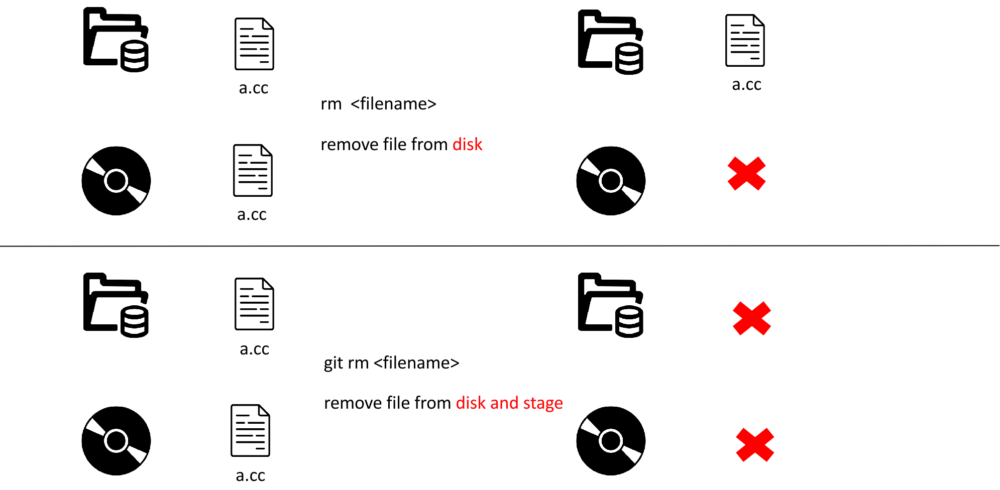
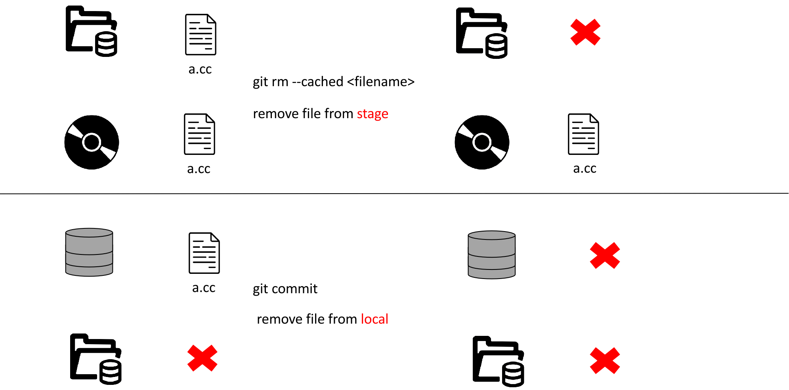
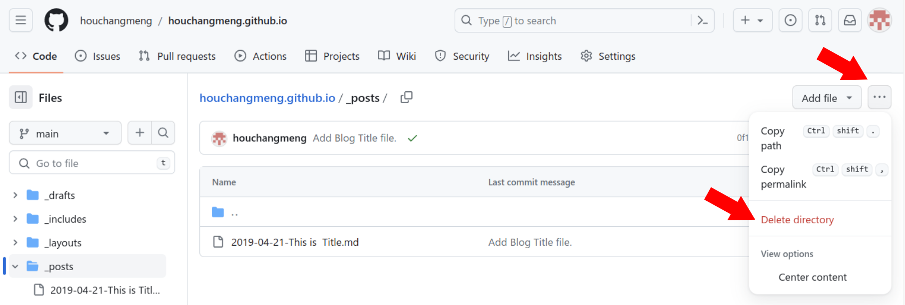

# Git/Github




---

## 参考

https://www.bilibili.com/video/BV19e4y1q7JJ

https://www.bilibili.com/video/BV1r3411F7kn

---

## 其他

### 从stage/commit中删除文件

从磁盘中删除文件

```{bash}
rm <filename>
```

从磁盘和暂存区都删除了文件

```{bash}
git rm <filename>
```



---

从暂存区删除了文件，但是不删除磁盘中的文件，此时文件为未追踪状态

```{bash}
git rm --cached <filename>
```

暂存区中已经删除了文件，在本地仓库中也删除这个文件

```{bash}
git commit --amend --allow-empty
```

commit的id和上次相同，–allow-empty意思是允许commit的comment为空，将暂存区的文件重新提交一次空的commit



---

从远程仓库中删除文件/文件夹



---
### 恢复/检索文件

从历史提交记录中恢复文件

```{bash}
git reset --hard/soft/mixed <ID>
```

---

从暂存区中恢复文件

```{bash}
git restore <filename> 复制文件
```

```{bash}
git reset --staged <filename> 移动文件
```


