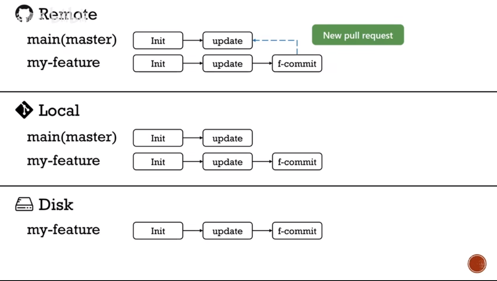
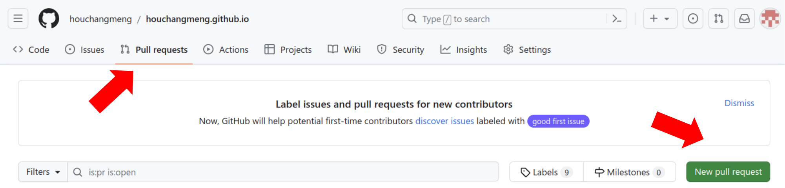
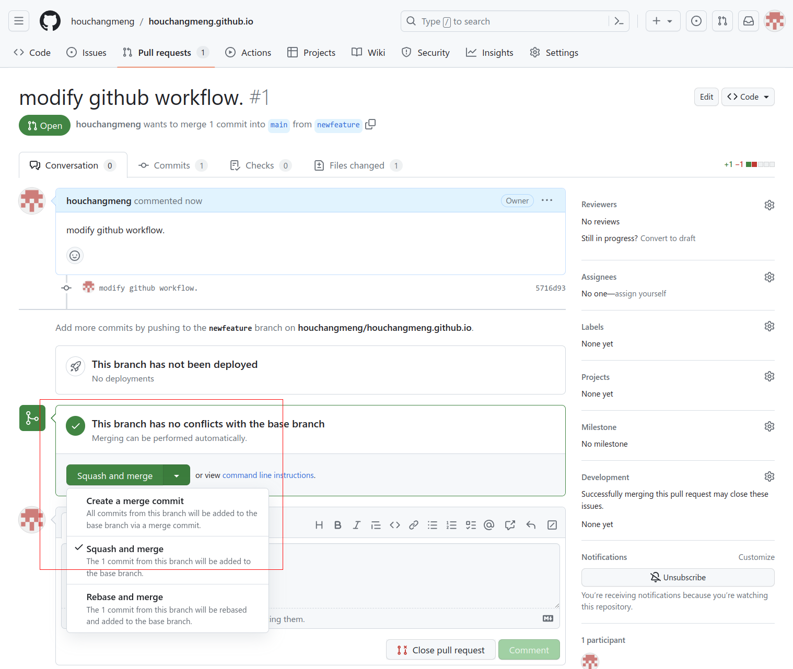

# Git/Github


---

## 参考

https://www.bilibili.com/video/BV19e4y1q7JJ

https://www.bilibili.com/video/BV1r3411F7kn

---

## 如果在写自己的代码过程中, 远端GitHub上代码出现改变


**Step1.** 保存当前分支，即`newfeature`分支的代码，并提交到本地仓库  

```{bash}
git add . 
git commit -m "commit description"
```

---

**Step2.** 切换回`main/master`分支

```{bash}
git checkout main
```


---

**Step3.** 将远端修改过的代码更新到本地仓库和磁盘  

```{bash}
git pull origin master(main) 
```


---

**Step4.** 回到`newfeature`分支

```{bash}
git checkout newfeature 
```


---

**Step5.** 在`newfeature`分支上，用`git rebase 命令`先把`main`分支上的内容移过来。这会根据之前提交的`commit`来修改成新的内容，中途可能会出现`rebase conflict`，这时手动选择保留哪段代码。此时仍然在`newfeature`分支上。

```{bash}
git rebase main
```


`git rebase` 图示


---

**Step6.** 把rebase后并且更新过的代码再push到远端github上(`-f` 强行)  

```{bash}
git push -f origin newfeature 
```


---

**Step7.** 项目成员在github网页中的*Pull request*点击*New pull request*,向项目主人发起一个合并请求。






---

**Step8.** 项目主人采用Squash and merge合并Pull request中所有不同的commit  




---

**Step9.** 项目主人删除`newfeature`分支


---
---

## 远端完成更新后

**Step1.** 项目成员在本地切换到 `main` branch上

---

**Step2.** 删除本地的git分支

```{bash}
git branch -D newfeature 
```


---

**Step3.** 再把远端的最新代码拉至本地  

```{bash}
git pull origin main 
```


