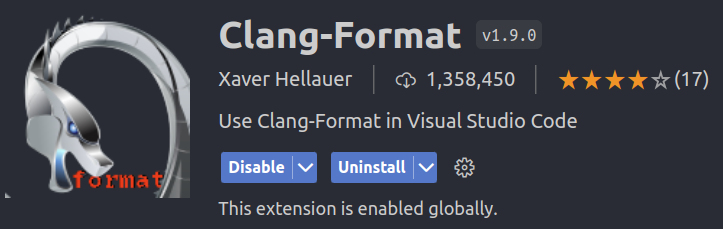
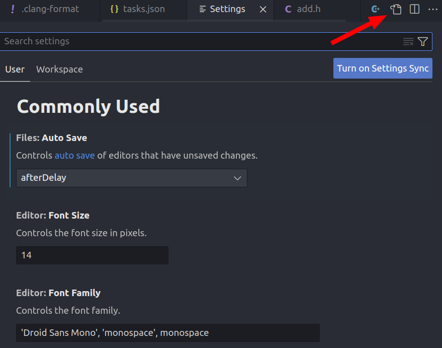
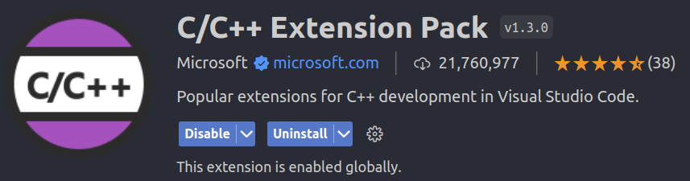
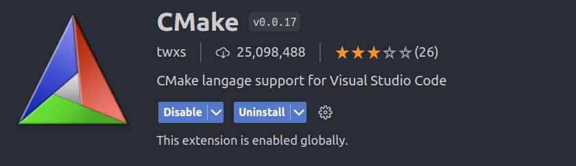
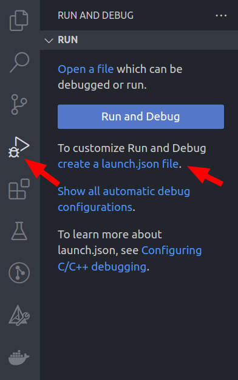
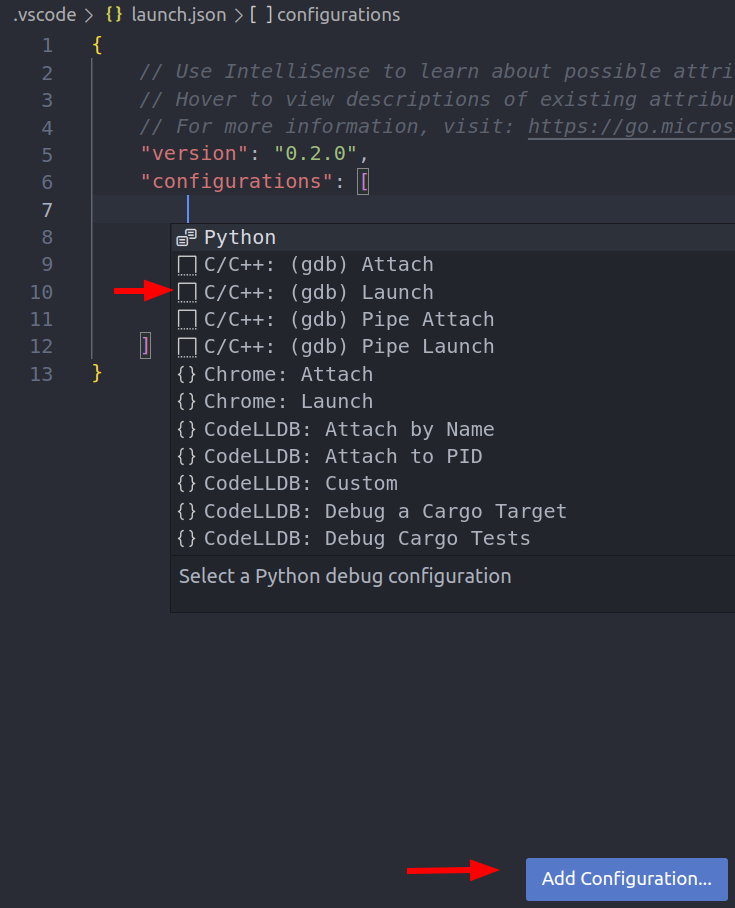
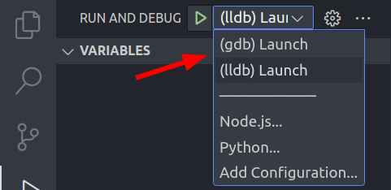
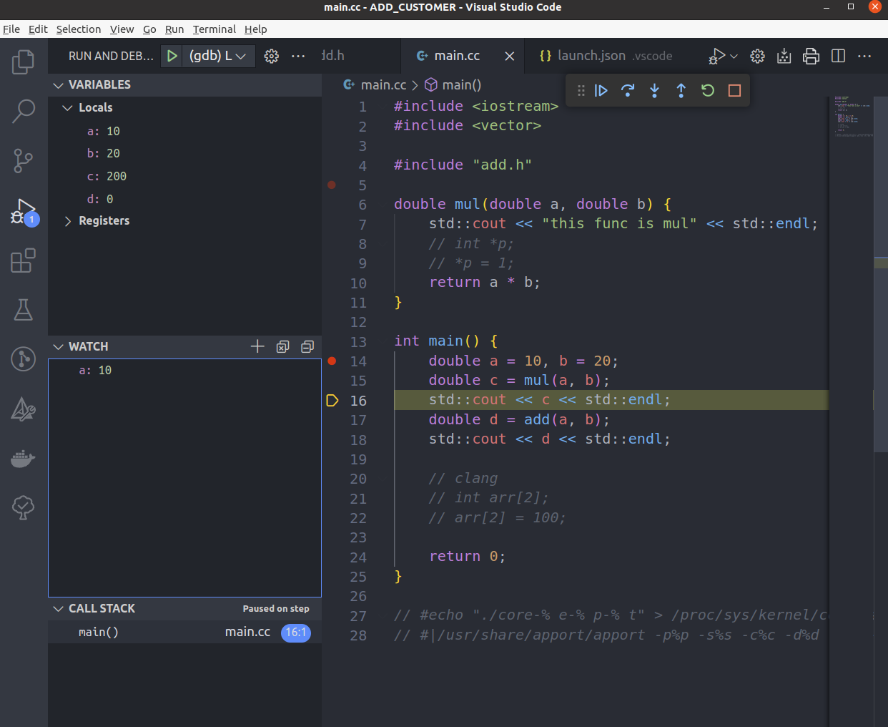

# C++, VsCode工具配置

工欲善其事,必先利其器。本文主要阐述了在Ubuntu20.04中，使用 Visual Studio Code 开发 C/C++ 代码的相关工具配置，包括 统一格式 和 代码调试 。使用VSCode官方提供的插件来进行C++代码的编译和调试，使用Clang-format对代码的格式进行管理。

> clang-format 是 LLVM 开发的用于格式化 C/C++/Java/JavaScript/Objective-C/Objective-C++/Protobuf 等多种语言代码的工具，借助 clang-format 可以实现代码仓库的风格统一，提升开发效率。
>

## 前期准备

- 安装Ubuntu20.04

- 安装Visual Studio Code

- 安装gcc，gdb，cmake

以上网络搜索自行安装。

---

## 统一风格管理

良好统一的代码风格在多人协同开发中至关重要，不统一的代码风格会在代码版本管理中引入由于格式修改而带来的代码变更，使版本维护变得困难且容易出错。

### 安装 clang-format

打开终端，安装clang-format

```{shell}
sudo apt install clang-format-10
```

这里需要注意的是，不能通过 `sudo apt install clang-format` 命令进行安装，因为对于不同的 Ubuntu 发行版而言，通过该命令安装得到的 `clang-format` 版本是不同的。

安装完成后，我们能够使用的命令名是 `clang-format-10`，我们将其提级为 `clang-format`

```{shell}
sudo update-alternatives --install /usr/bin/clang-format clang-format /usr/bin/clang-format-10 100
```

后面当我们使用 `clang-format` 命令时，指代的即为 `clang-format-10`

在安装完clang-format后，可以对单个文件进行统一格式处理

```{shell}
clang-format -style=google -i demo.cpp
```

上面命令表示对 `demo.cpp` 文件用 Google 风格进行统一处理

### 在Visual Studio Code 中集成风格管理

安装插件



设置插件参数

点击 vscode 左下角齿轮，打开 `setting` , 在 setting **右上角**，点击在 json 文件中打开, 如下图。



在 json 中添加如下几行

```{json}
"editor.formatOnSave": true, 
"[cpp]": {
    "editor.defaultFormatter": "xaver.clang-format" 
},
"[c]": {
    "editor.defaultFormatter": "xaver.clang-format"
},
```

这样就实现了**保存时代码风格自动管理**。

### 自定义代码风格

每次对代码进行格式化时使用的是 clang-format 默认的风格，clang-format 支持包括 LLVM、Google、Chromium、Mozilla、WebKit 等在内的多种风格。我们可以在已有风格的基础上自定义一个名为 `.clang-format` 的代码风格文件放在仓库根目录下，以后保存代码时 clang-format 将根据文件中定义的规则对代码进行格式化。

首先生成 Google 风格的 `.clang-format` 模板文件：

```{shell}
clang-format -style=google -dump-config > .clang-format
```

生成的文件截取一部分如下所示，可以根据团队开发规范或个人喜好对生成的 `.clang-format` 进行自定义。各个选项的具体含义可以在[官方文档](https://clang.llvm.org/docs/ClangFormatStyleOptions.html)中找到。

```{yaml}
---
Language:        Cpp
# BasedOnStyle:  Google
AccessModifierOffset: -1
AlignAfterOpenBracket: Align
AlignConsecutiveMacros: false

······(省略部分内容)

SpacesInSquareBrackets: false
SpaceBeforeSquareBrackets: false
Standard:        Auto
TabWidth:        8
UseCRLF:         false
UseTab:          Never
```

---

## 在VSCode中调试C++程序

安装好插件





创建 `launch.json` 文件



打开launch.json文件，点击右下角的 Add Configuration ，添加调试选项。



生成的文件如下所示，调试的时候只需要将 `"program"` 条目改成想要调试的文件。

```{}
{
    "version": "0.2.0",
    "configurations": [
        

        {
            "name": "(gdb) Launch",        // 调试的名字
            "type": "cppdbg",              // 只能是cppdbg
            "request": "launch",           // launch：启动，attach：附加
            "program": "${workspaceFolder}/bin/run_fusion", // 需要调试的程序, 一般情况只需要改这里就可以
            "args": [],                    // 调试时传递给程序的参数
            "stopAtEntry": false,          // 调试时是否停在程序入口：{true：是，false：否}
            "cwd": "${workspaceFolder}",   // 工作目录
            "environment": [],             // 环境变量
            "externalConsole": false,      // 是否输出到外部工作台
            "MIMode": "gdb",
            "setupCommands": [             // 设置的gdb参数
                {
                    "description": "Enable pretty-printing for gdb",
                    "text": "-enable-pretty-printing",
                    "ignoreFailures": true,
                    
                },
                {
                    "description": "Set Disassembly Flavor to Intel",
                    "text": "-gdb-set disassembly-flavor intel",
                    "ignoreFailures": true
                }
            ]
        },
        
    ]
}
```

使用CMake构建，编译程序，注意在写CMakelist.txt的时候，设置编译选项为默认或Debug，另外需要注意的是，**不要设置编译优化**。

```{CMakeLists}
set(DEFAULT_BUILD_TYPE "Debug")
# set(CMAKE_CXX_FLAGS "-O2 -g -ggdb ${CMAKE_CXX_FLAGS}") # 错误！ 不要设置编译优化 -O2
```

然后**按下F5**, 或点击Vscode左侧 `debug` 按钮，再点击绿色小三角，即可调试文件。

也可以在 `launch.json` 文件中添加其他的 Configuration，设置不同的调试选项和调试文件，在调试前选择想进行的调试即可。





另外也有 `clang + clangd + codelldb + cmake` 配置VSCode C++环境的方法 [link](https://zhuanlan.zhihu.com/p/566365173)，更适合大型项目，但是 `clangd`插件 和 `C/C++` 插件存在冲突， 而 `ROS` 插件又必须依赖 `C/C++` 插件, 因此放弃这种配置。

---

## 参考

[使用 clang-format 进行 C++ 代码风格管理](https://blog.shipengx.com/archives/ed6ff3ad.html)

[Clang-Format Style Options](https://clang.llvm.org/docs/ClangFormatStyleOptions.html)

[如何解决vscode语言服务器崩溃？](https://www.zhihu.com/question/353410590)

[VScode tasks.json和launch.json的设置](https://zhuanlan.zhihu.com/p/92175757)
